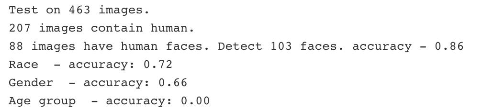

# README

## Human Face Recognition and Facial Attributes Extraction

- Reference

This repo is forked from [**FairFace: Face Attribute Dataset for Balanced Race, Gender, and Age for Bias Measurement and Mitigation**](https://github.com/dchen236/FairFace). We modified the code slightly for actual deployment and production purpose.

- Required packages
    - pytorch1.10
    - dlib
    - numpy, pandas

- Model Architecture

    -  **Face recognition**:
In the forked repo, they used pretrain *Maximum of Margin Object Detection* model in dlib for face recognition.

    - **Facial attribute extraction**: In the forked repo, they trained a model using ResNet34 as backbone for facial attribute extraction. However, no further details about the model is disclosed in the [original paper](https://openaccess.thecvf.com/content/WACV2021/papers/Karkkainen_FairFace_Face_Attribute_Dataset_for_Balanced_Race_Gender_and_Age_WACV_2021_paper.pdf).

- How to Run the Program

1. First need to download the pretrain model [here](https://drive.google.com/drive/folders/1F_pXfbzWvG-bhCpNsRj6F_xsdjpesiFu) and put them under the `FairFace/resnet_model` folder. 

2. Then run the following command in terminal, specifying:
    - `--input_path` as base path to store the input images
    - `--input_csv` as the path of Faster R-CNN prediction result of human body
    - `--face_path` as the path to store the detected human face images
    - `--save_path` as the path to store model output `face_attributes.csv`
    - `--model_path` as the path to the chosen resnet model
    - `--face_size` as the size of cropped human face
    - `--progress` as the number of images printed during model prediction progress.

```
python predict.py --input_path="../HKTVMall_data" --input_csv="../human_detection/result/frcnn_result.csv" --face_path="detect_faces" --save_path="result/face_attributes.csv" --model_path="res34_fair_align_multi_4_20190809.pt" --face_size=300 --progress=20
```

- Performance on subset of images

We first tested the model performance on a subset of 463 images.




