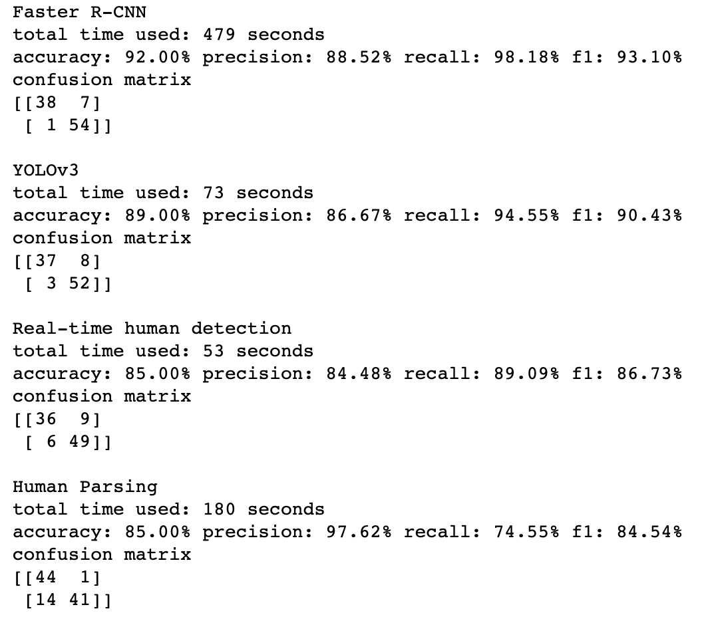
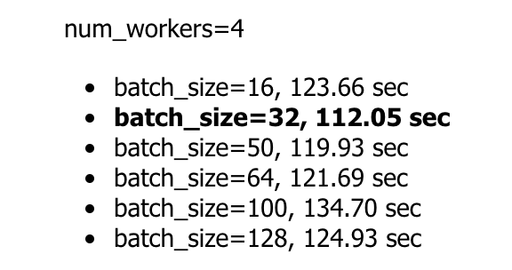

# README

## Human Detection
- Required packages
    - pytorch1.10
    - cv2
    - numpy, pandas, matplotlib, sklearn

- Model Architecture

We tried several pre-trained models including YOLOv3, human parsing (semantic segmentation) and Faster R-CNN with a ResNet50 backbone. After comparing their classifcation performance, we choosed Faster R-CNN as the final model. 

- How to Run the Program
```
python frcnn.py --batch_size=32 --num_workers=6 --data_path="path to the data folder" --output_path="frcnn_result.csv"
```

- Experiement Setting

The following performance of Faster R-CNN is tested on a 6-core GPU at Microsoft Azure.

    - Performance comparison across model



    - Computation time of faster r-cnn across batch_size



